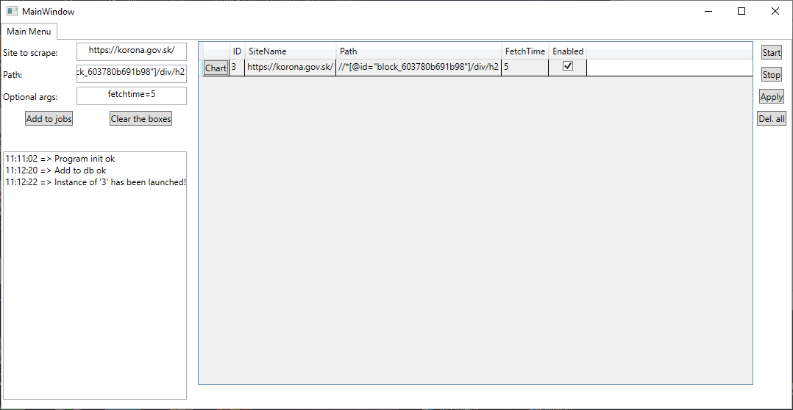
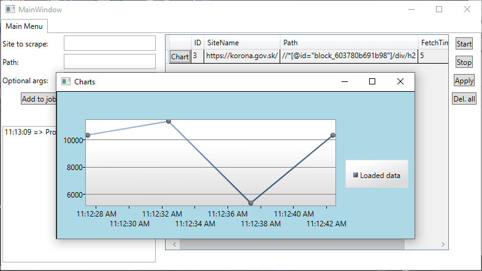

# C# Number Scraper with charts

You can set in this program what site to scrape, scrape XPATH (only numbers will be scraped), and optional arguments.
SQLITE is used for storing the data, which is also automatically created on start.

### Optional arguments

Those arguments are separated by comma (,). The optional arguments are: **fetchtime** and **isEnabled**.

**fetchtime** determines how often the program should scrape the data from the web.

**isEnabled** is a flag, that if set, then the instance will automatically start. This can be changed in the table.

Example:

**Here the instance was launched (that is indicated in log as well):**

# Buttons explained

Start button will start all the instances that are enabled (flag isEnabled is set).

Stop button will terminate all instances running.

Apply button will save all changes that were made in the table.

Del. all button will everything from the database.

# Charts

Charts are also available by clicking on chart, the site has to be scrapped before (data need to be in DB).

